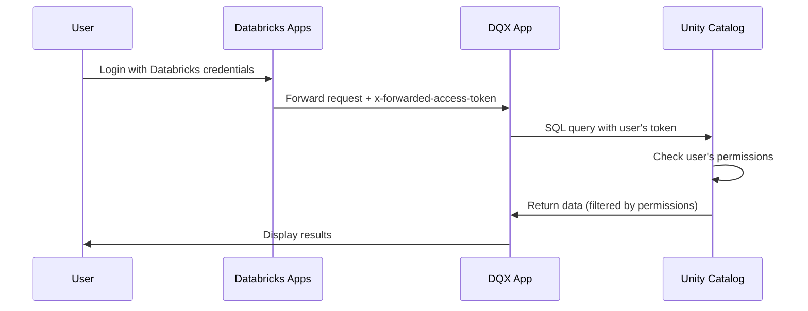
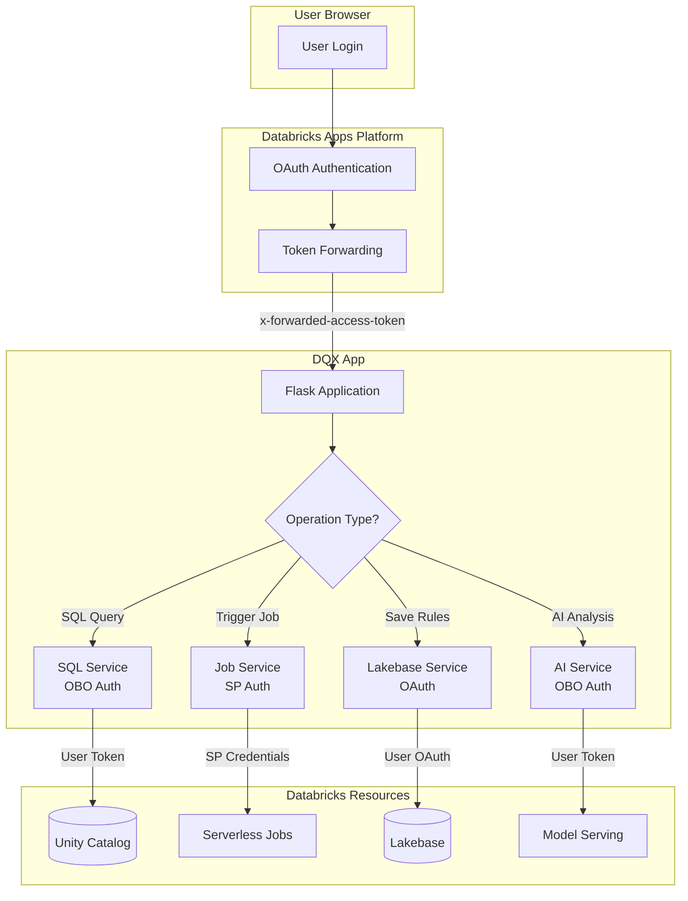

# Authentication

This document describes the authentication architecture used by DQX Data Quality Manager.

---

## Overview

DQX Data Quality Manager uses a **dual authentication model** to securely access Databricks resources:

| Operation | Authentication Method | Why |
|-----------|----------------------|-----|
| SQL queries (Unity Catalog) | **User Token (OBO)** | Access data with user's permissions |
| AI Analysis (ai_query) | **User Token (OBO)** | Execute queries as user |
| Job execution | **App Service Principal** | No "jobs" scope available for user auth |
| Lakebase storage | **User OAuth Token** | Store rules with user identity |

---

## On-Behalf-Of (OBO) Authentication

### What is OBO?

On-Behalf-Of (OBO) authentication allows the app to act on behalf of the logged-in user. When a user accesses the app through Databricks Apps, their OAuth token is forwarded to the application via the `x-forwarded-access-token` HTTP header.



### Benefits of OBO

1. **Security**: Users only see data they have permission to access
2. **Audit Trail**: All actions are logged under the user's identity
3. **No Elevated Privileges**: App doesn't need broad data access permissions
4. **Compliance**: Data access follows organizational policies

---

## SQL Operations (OBO)

All Unity Catalog operations use the user's forwarded token:

### How It Works

```python
# src/app/services/databricks.py

def _get_user_token(self) -> Optional[str]:
    """Get user's access token from request headers."""
    if has_request_context():
        token = request.headers.get('x-forwarded-access-token')
        return token
    return None

def _get_sql_connection(self):
    """Get SQL connection using user's token (OBO)."""
    user_token = self._get_user_token()

    if user_token:
        # OBO authentication using user's token
        return sql.connect(
            server_hostname=host,
            http_path=http_path,
            access_token=user_token  # User's forwarded token
        )
```

### Operations Using OBO

| Operation | SQL Command | User Permission Required |
|-----------|-------------|-------------------------|
| List catalogs | `SHOW CATALOGS` | `USE CATALOG` |
| List schemas | `SHOW SCHEMAS IN catalog` | `USE SCHEMA` |
| List tables | `SHOW TABLES IN catalog.schema` | `USE SCHEMA` |
| Sample data | `SELECT * FROM table LIMIT n` | `SELECT` on table |
| AI analysis | `SELECT ai_query(...)` | Model Serving access |

### Configuration

To enable SQL OBO authentication, configure these in your app:

```yaml
# resources/apps.yml
resources:
  apps:
    dqx_app:
      # Request SQL scope for OBO
      user_api_scopes:
        - sql

      # Grant access to SQL warehouse
      resources:
        - name: "dqx-sql-warehouse"
          sql_warehouse:
            id: ${var.sql_warehouse_id}
            permission: "CAN_USE"
```

---

## Job Operations (Service Principal)

Job operations use the **App Service Principal** instead of user tokens because there's no `jobs` scope available for user authorization in Databricks Apps.

### How It Works

```python
# src/app/services/databricks.py

def trigger_dq_job(self, table_name: str, user_prompt: str) -> Dict:
    """Trigger job using app SP credentials (not user token)."""
    # use_user_token=False means use app's service principal
    client = self._get_client(use_user_token=False)

    response = client.jobs.run_now(
        job_id=int(Config.DQ_GENERATION_JOB_ID),
        job_parameters={...}
    )
    return {"run_id": response.run_id}
```

### Permission Setup

The app's service principal needs `CAN_MANAGE_RUN` permission on jobs:

```yaml
# resources/apps.yml
resources:
  apps:
    dqx_app:
      resources:
        # Grant app SP permission to run generation job
        - name: "dqx-generation-job"
          job:
            id: ${resources.jobs.dq_rule_generation.id}
            permission: "CAN_MANAGE_RUN"

        # Grant app SP permission to run validation job
        - name: "dqx-validation-job"
          job:
            id: ${resources.jobs.dq_rule_validation.id}
            permission: "CAN_MANAGE_RUN"
```

---

## Lakebase Authentication (OAuth)

Lakebase (Databricks PostgreSQL) uses OAuth authentication with the user's forwarded token.

### How It Works

```python
# src/app/services/lakebase.py

def get_connection():
    """Get PostgreSQL connection using OAuth."""
    user_email, user_token = get_user_oauth_credentials()

    conn = psycopg2.connect(
        host=Config.LAKEBASE_HOST,
        database=Config.LAKEBASE_DATABASE,
        user=user_email,        # User's email from token
        password=user_token,    # OAuth token as password
        port=5432,
        sslmode='require'
    )
    return conn
```

### User Identification

The user's email is extracted from:
1. `x-forwarded-email` header (if available), or
2. Databricks API call using the token to get current user

```python
def get_user_oauth_credentials() -> Tuple[str, str]:
    user_token = request.headers.get('x-forwarded-access-token')
    user_email = request.headers.get('x-forwarded-email')

    if not user_email:
        # Fallback: query Databricks for user info
        ws = WorkspaceClient(token=user_token)
        current_user = ws.current_user.me()
        user_email = current_user.user_name

    return user_email, user_token
```

---

## AI Analysis Authentication

AI analysis uses the Statement Execution API with the user's token:

```python
# src/app/services/ai.py

def analyze_rules(rules, table_name, user_prompt):
    # Get WorkspaceClient with user's token
    ws = databricks_service.client  # Uses OBO

    # Execute ai_query via Statement Execution API
    response = ws.statement_execution.execute_statement(
        warehouse_id=warehouse_id,
        statement=f"SELECT ai_query('{model}', '{prompt}')",
        wait_timeout="0s"
    )
```

---

## Authentication Flow Diagram



---

## Local Development

For local development without Databricks Apps, use a personal access token:

```bash
export DATABRICKS_HOST="https://your-workspace.cloud.databricks.com"
export DATABRICKS_TOKEN="your-personal-access-token"
export DQ_GENERATION_JOB_ID="your-job-id"
```

The app will fall back to the configured token when no `x-forwarded-access-token` header is present:

```python
if user_token:
    # OBO authentication (production)
    return sql.connect(..., access_token=user_token)
elif Config.DATABRICKS_TOKEN:
    # Fallback to configured token (local dev)
    return sql.connect(..., access_token=Config.DATABRICKS_TOKEN)
```

---

## Security Best Practices

!!! warning "Security Recommendations"

    1. **Never log tokens**: Avoid logging access tokens in production
    2. **Use HTTPS**: All connections use TLS encryption
    3. **Minimal scopes**: Request only necessary API scopes (`sql`)
    4. **Audit logging**: All operations are logged with user identity
    5. **Token expiration**: OAuth tokens have limited lifetime

---

## Troubleshooting

### Common Issues

| Issue | Cause | Solution |
|-------|-------|----------|
| "No catalogs available" | Missing `sql` scope or warehouse permission | Check `user_api_scopes` includes `sql` |
| "Job failed to start" | SP missing job permissions | Verify `CAN_MANAGE_RUN` in apps.yml |
| "Lakebase connection failed" | Invalid OAuth token | Ensure user is logged in via Databricks Apps |
| "AI analysis unavailable" | Token doesn't have model access | Grant user access to model serving endpoint |

### Debug Mode

Enable debug logging to see authentication details:

```python
# In databricks.py
print(f"[DEBUG] User token found (length: {len(token)})")
print(f"[DEBUG] Creating SQL connection with OBO auth, host={host}")
```

Check app logs in Databricks Console → Compute → Apps → Logs.

---

## Related Documentation

- [Databricks Apps Authentication](https://docs.databricks.com/aws/en/dev-tools/databricks-apps/auth)
- [User API Scopes](https://docs.databricks.com/aws/en/dev-tools/databricks-apps/configuration.html#user-api-scopes)
- [Service Principal Setup](https://docs.databricks.com/aws/en/admin/users-groups/service-principals.html)
