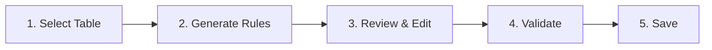

# Quick Start Guide

Complete guide for deploying, configuring, and operating DQX Data Quality Manager.

---

## Prerequisites

### Required Tools

| Tool | Installation |
|------|--------------|
| Databricks CLI v0.200+ | `pip install databricks-cli` or [Install Guide](https://docs.databricks.com/dev-tools/cli/install.html) |
| Python 3.13+ | For local development |

### Databricks Workspace Requirements

| Requirement | Description |
|-------------|-------------|
| Unity Catalog | Must be enabled |
| SQL Warehouse | Any warehouse (Serverless recommended) |
| Databricks Apps | Must be enabled on workspace |
| Model Serving (optional) | For AI analysis feature |
| Lakebase (optional) | For saving rules with versioning |

### User Permissions

| Resource | Permission |
|----------|------------|
| Unity Catalog | `USE CATALOG`, `USE SCHEMA`, `SELECT` on target tables |
| SQL Warehouse | `CAN USE` |
| Jobs | `CAN MANAGE RUN` (granted automatically via DAB) |
| Lakebase | OAuth access (if using save feature) |

---

## Quick Start

```bash
# 1. Clone and configure
git clone https://github.com/dediggibyte/databricks_dqx_agent.git
cd databricks_dqx_agent
export DATABRICKS_HOST="https://your-workspace.cloud.databricks.com"

# 2. Deploy the bundle (notebooks are deployed automatically)
databricks bundle validate -t dev
databricks bundle deploy -t dev

# 3. Access your app
open https://your-workspace.cloud.databricks.com/apps/dqx-rule-generator-dev
```

!!! success "That's it!"
    DAB automatically deploys notebooks to `${workspace.root_path}/notebooks/` and configures job permissions. No manual notebook upload required.

---

## Step-by-Step Deployment

### Step 1: Set Workspace

```bash
export DATABRICKS_HOST="https://your-workspace.cloud.databricks.com"
```

### Step 2: Validate Bundle

```bash
databricks bundle validate -t dev
```

This checks:
- YAML syntax
- Variable resolution
- Resource definitions

### Step 3: Deploy

```bash
databricks bundle deploy -t dev
```

This creates:
- Databricks App (`dqx-rule-generator-dev`)
- Generation Job (`DQ Rule Generation - Dev`)
- Validation Job (`DQ Rule Validation - Dev`)
- Syncs notebooks to workspace

### Step 4: Access Application

```
https://your-workspace.cloud.databricks.com/apps/dqx-rule-generator-dev
```

---

## Configuration

### Required Configuration

After deployment, verify these are set in `src/app.yaml`:

```yaml
env:
  - name: SQL_WAREHOUSE_ID
    value: "<your-sql-warehouse-id>"
```

!!! tip "Get Warehouse ID"
    ```bash
    databricks warehouses list --output json | jq '.[].id'
    ```

### Optional Configuration

| Feature | Configuration |
|---------|--------------|
| **Lakebase** | Set `LAKEBASE_HOST` for rule storage |
| **AI Analysis** | Set `MODEL_SERVING_ENDPOINT` (default: `databricks-claude-sonnet-4-5`) |

See [Configuration](configuration.md) for full details.

---

## Multi-Environment Deployment

| Target | Command | App Name |
|--------|---------|----------|
| Development | `databricks bundle deploy -t dev` | dqx-rule-generator-dev |
| Staging | `databricks bundle deploy -t stage` | dqx-rule-generator-stage |
| Production | `databricks bundle deploy -t prod` | dqx-rule-generator |

---

## Using the Application

### Workflow



### Step 1: Select Table

1. Select Catalog from dropdown
2. Select Schema
3. Select Table
4. Preview sample data

### Step 2: Generate Rules

1. Enter natural language prompt describing your requirements
2. Click "Generate Rules"
3. Wait for job completion (typically 1-3 minutes)

**Example Prompts:**
```
"Ensure customer_id is not null and unique"
"Validate email format and check age is between 0 and 120"
"Check order_date is not in the future and amount is positive"
```

### Step 3: Review & Edit

1. Review generated rules in JSON format
2. Edit rules as needed
3. Use "Format JSON" to clean up formatting

### Step 4: Validate (Optional)

1. Click "Validate Rules" to test against actual data
2. Review pass/fail statistics
3. Fix rules with high violation counts

### Step 5: Save to Lakebase

1. Click "Analyze with AI" for rule coverage insights
2. Click "Confirm & Save" to store rules
3. Rules are versioned automatically

---

## CI/CD Pipeline

### Automated Deployment

| Environment | Trigger | Workflow |
|-------------|---------|----------|
| `dev` | Push to `main`, PR | `.github/workflows/ci-cd-dev.yml` |
| `stage` | Manual | `.github/workflows/ci-cd-stage.yml` |
| `prod` | Manual | `.github/workflows/ci-cd-prod.yml` |

### GitHub Secrets Required

Configure per environment in GitHub Settings → Secrets:

| Secret | Description |
|--------|-------------|
| `DATABRICKS_HOST` | Workspace URL |
| `DATABRICKS_CLIENT_ID` | Service Principal Client ID |
| `SQL_WAREHOUSE_ID` | SQL Warehouse ID |
| `LAKEBASE_HOST` | (Optional) Lakebase host |

### GitHub OIDC Setup

1. Create Service Principal in Databricks Account Console
2. Create Federation Policy:
   ```bash
   databricks account service-principal-federation-policy create <SP_ID> --json '{
     "oidc_policy": {
       "issuer": "https://token.actions.githubusercontent.com",
       "audiences": ["<DATABRICKS_ACCOUNT_ID>"],
       "subject": "repo:<GITHUB_ORG>/<REPO_NAME>:environment:<ENV>"
     }
   }'
   ```
3. Grant workspace access to the service principal

See [CI/CD Pipeline](ci-cd.md) for detailed setup.

---

## Troubleshooting

### Common Issues

| Issue | Cause | Solution |
|-------|-------|----------|
| "No catalogs available" | Missing permissions or warehouse down | Check `USE CATALOG` permission, verify SQL Warehouse is running |
| "Job failed: Unable to access notebook" | Notebook path issue | Ensure using `${workspace.root_path}/notebooks/...` in variables.yml |
| "Lakebase connection failed" | Wrong host or not authenticated | Verify `LAKEBASE_HOST`, ensure user is logged in via Databricks Apps |
| "AI Analysis unavailable" | Endpoint not configured | Verify `MODEL_SERVING_ENDPOINT` exists and user has access |
| Bundle validation fails | Missing DATABRICKS_HOST | Run `export DATABRICKS_HOST="..."` |

### Check Logs

**App Logs:**
```bash
# Via CLI
databricks apps logs dqx-rule-generator-dev

# Or via Console
# Databricks Console → Compute → Apps → Select app → Logs
```

**Job Logs:**
```bash
# List recent runs
databricks jobs list-runs --job-id <JOB_ID> --limit 5

# Get run output
databricks jobs get-run-output --run-id <RUN_ID>
```

### Health Check

```bash
curl https://<workspace>/apps/dqx-rule-generator-dev/health
```

Expected response:
```json
{"status": "healthy", "timestamp": "..."}
```

### Debug Endpoint

```bash
curl https://<workspace>/apps/dqx-rule-generator-dev/api/debug
```

---

## Local Development

For local development without Databricks Apps:

```bash
# Required environment variables
export DATABRICKS_HOST="https://your-workspace.cloud.databricks.com"
export DATABRICKS_TOKEN="your-personal-access-token"
export DQ_GENERATION_JOB_ID="your-generation-job-id"
export DQ_VALIDATION_JOB_ID="your-validation-job-id"
export SQL_WAREHOUSE_ID="your-warehouse-id"

# Optional
export LAKEBASE_HOST="your-lakebase-host"

# Run the app
cd src
pip install -r requirements.txt
python wsgi.py
```

Access at: `http://localhost:8000`

---

## Maintenance

### Update Application

```bash
# Make code changes, then redeploy
databricks bundle deploy -t dev
```

### View Saved Rules

```sql
-- Query Lakebase directly
SELECT table_name, version, created_at, is_active
FROM dq_rules_events
WHERE table_name = 'catalog.schema.table'
ORDER BY version DESC;
```

### Destroy Deployment

```bash
databricks bundle destroy -t dev
```

!!! warning "Destructive Operation"
    This removes the app, jobs, and all deployed resources. Saved rules in Lakebase are preserved.

---

## Quick Reference

| Action | Command |
|--------|---------|
| Set workspace | `export DATABRICKS_HOST="https://..."` |
| Validate | `databricks bundle validate -t dev` |
| Deploy | `databricks bundle deploy -t dev` |
| List jobs | `databricks jobs list` |
| Check health | `curl <app-url>/health` |
| View app logs | `databricks apps logs <app-name>` |
| Destroy | `databricks bundle destroy -t dev` |

---

## Related Documentation

- [Configuration](configuration.md) - Detailed config reference
- [Authentication](authentication.md) - OBO and security details
- [Architecture](architecture.md) - System design
- [API Reference](api-reference.md) - REST endpoints
- [CI/CD](ci-cd.md) - GitHub Actions setup
- [DQX Checks](dqx-checks.md) - Available check functions
